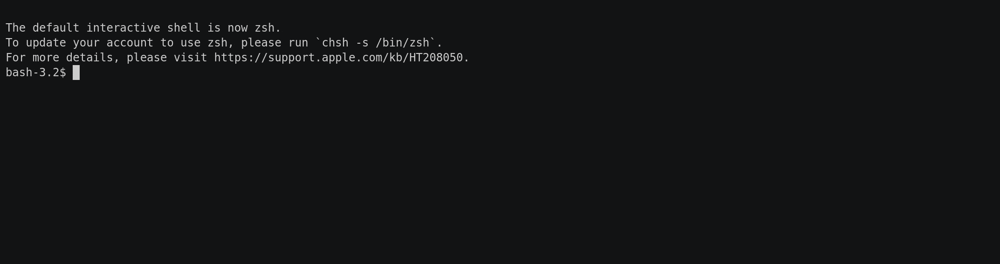

# Tiny玩具语言(Go语言版)

Tiny语言是[《编译原理及实践》](https://book.douban.com/subject/1088057/)书中定义的玩具语言。

这里是Go语言实现(注释采用Go语言风格)。

实现原理：

- [COMET虚拟计算机说明](./comet/README.md)
- [COMET虚拟机的设计与实现.pdf](./docs/comet-vm.pdf)

## 例子

以下的例子计算1到n之和：

```
// sum = 1 + 2 + ... + n

read n;
if 0 < n then
  sum := 0;
  repeat
    sum := sum + n;
    n := n - 1
  until n = 0;
  write sum
end
```

运行tiny程序:

```
$ tinylang sum.tiny 
100
5050
```

也可以通过`-ast`查看生成的语法树，通过`-casl`查看生成的CASL汇编程序，或通过`-debug`调试执行：



## 版权

保留所有权利。
