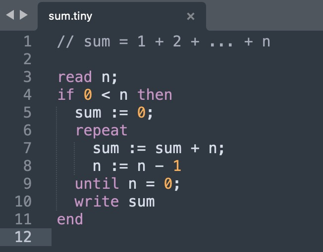

# Tiny 语言 Sublime Text 支持

尚在开发阶段，欢迎加入共建。

## 语法高亮

在控制台通过 `sublime.packages_path()` 命令查看包目录，将 `tiny.sublime-syntax` 文件复制到 `User` 子目录中。然后重启 Sublime Text 打开凹语言代码，效果如下：



## LSP 服务

首先安装 LSP 插件，然后配置如下：

```json
// Settings in here override those in "LSP/LSP.sublime-settings"
{
  // General settings
  "show_diagnostics_panel_on_save": 0,

  // Language server configurations
  "clients": {
    "tiny-lang": {
      // enable this configuration
      "enabled": true,
      // the startup command -- what you would type in a terminal
      "command": ["tiny-lsp"],
      // the selector that selects which type of buffers this language server attaches to
      "selector": "source.tiny"
    }
  }
}
```

注：`tiny-lsp` 命令尚在开发阶段，欢迎加入共建。

## 参考资料

- https://www.sublimetext.com/docs/syntax.html
- https://packagecontrol.io/packages/LSP
